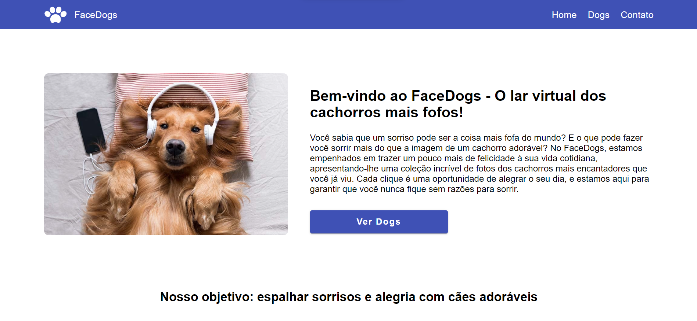

<h1 align="center"> FaceDogs</h1>

<p align="center">
Primeira task do módulo de Angular da trilha de front do Vem Ser DBC
</p>

<p align="center">
  <a href="#-tecnologias">Tecnologias</a>&nbsp;&nbsp;&nbsp;|&nbsp;&nbsp;&nbsp;
    <a href="#-instalacao-do-projeto">Instalação do projeto</a>&nbsp;&nbsp;&nbsp;|&nbsp;&nbsp;&nbsp;
  <a href="#-sobre-o-projeto">Sobre o Projeto</a>&nbsp;&nbsp;&nbsp;
</p>

<p align="center">
  
</p>

<p align="center">
  <a href="https://facedogs-rho.vercel.app/" target="_blank">➡️ Acesse o deploy!</a>
</p>

## 🚀 Tecnologias

Esse projeto foi desenvolvido com as seguintes tecnologias:

- Angular
- TypeScript
- Angular Material

## ⚙️ Instalação do projeto

Instalação das dependências:
```
npm install
```

Inicialização da aplicação:
```
ng serve --open
```


## 💻 Sobre o Projeto

FaceDogs é uma aplicação onde você pode ver fotos de cachorros fofos. Nela, você pode ver os nomes e fotos dos cachorros e também curtir as fotos que gostar. Também é possível entrar em contato preenchendo um formulário. 
